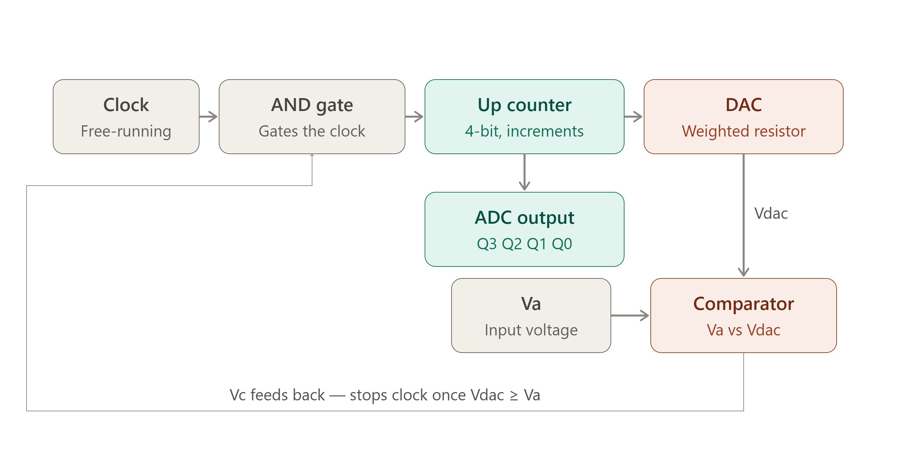
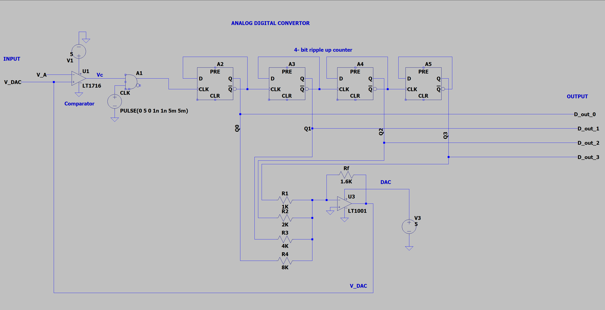

# 4-Bit Counter Type ADC using Verilog

## Overview

This project implements a **4-bit Counter Type Analog-to-Digital Converter (ADC)** using Verilog HDL. The ADC converts an analog input voltage into its equivalent 4-bit digital output using a combination of an asynchronous ripple counter, weighted resistor DAC, comparator, and clock gating logic.

The design follows the working principle of a conventional **Counter (Digital Ramp) ADC**, where a counter continuously increments until the DAC output equals or exceeds the analog input voltage.


## Features

- 4-bit Asynchronous Up Counter using D Flip-Flops
- 4-bit Weighted Resistor DAC
- Comparator for analog voltage comparison
- Clock gating using an AND gate
- Behavioral implementation suitable for digital simulation
- Modular Verilog design


# Block Diagram

The Signal flow of the ADC is shown below




# Counter Type ADC Architecture

The architecture is designed in LTspice shown below




# Working Principle

The Counter Type ADC operates by repeatedly comparing the analog input voltage with the output of an internal DAC.

The conversion process is as follows:

1. The asynchronous counter is reset to "0000".
2. The DAC converts the counter output into an analog voltage.
3. The comparator compares

   - Va (Analog Input)
   - Vdac (DAC Output)

4. If Va > Vdac
      
 the comparator output becomes HIGH.

5. The HIGH comparator output enables the AND gate, allowing clock pulses to reach the counter.

6. The counter increments with every clock pulse.

7. As the counter increments, the DAC output also increases.

8. When Vdac ≥ Va

  the comparator output becomes LOW.

9. The AND gate blocks any further clock pulses.

10. The counter stops, and its count represents the digital equivalent of the analog input.


# Example 

Assume


Reference Voltage = 5 V

Analog Input

Va = 2.75 V


For a 4-bit ADC,


| Counter (Decimal) | Counter (Binary) | DAC Output (V) | Comparator |
| ----------------: | :--------------: | -------------: | :--------: |
|                 0 |       0000       |         0.0000 |    HIGH    |
|                 1 |       0001       |         0.3125 |    HIGH    |
|                 2 |       0010       |         0.6250 |    HIGH    |
|             **3** |     **0011**     |     **0.9375** |   **LOW**  |

At Counter = 0011


# Project Structure

```
.
├── ADC_main.v            // Verilog source code
├── ADC_tb.v         // Testbench
├── README.md
├── docs
│   └── counter_type_adc_block_diagram.png
└── Circuit_Diagram.png       // GTKWave output
```


# Simulation

The design was simulated using

- Icarus Verilog
- GTKWave

Compile

```bash
iverilog -o adc.vvp module6.v testbench6.v
```

Run

```bash
vvp adc.vvp
```

Open Waveform

```bash
gtkwave adc.vcd
```


# Future Improvements

- Verilog-AMS implementation for true analog modeling
- Higher resolution (8-bit/10-bit/12-bit ADC)
- Successive Approximation Register (SAR) ADC implementation
- Flash ADC implementation
- Pipelined ADC architecture

---

# Author

**Aadi Jain**

Electronics Engineering Student

Interested in **Digital Design, Verilog HDL, FPGA Design, and VLSI Front-End Engineering.**
